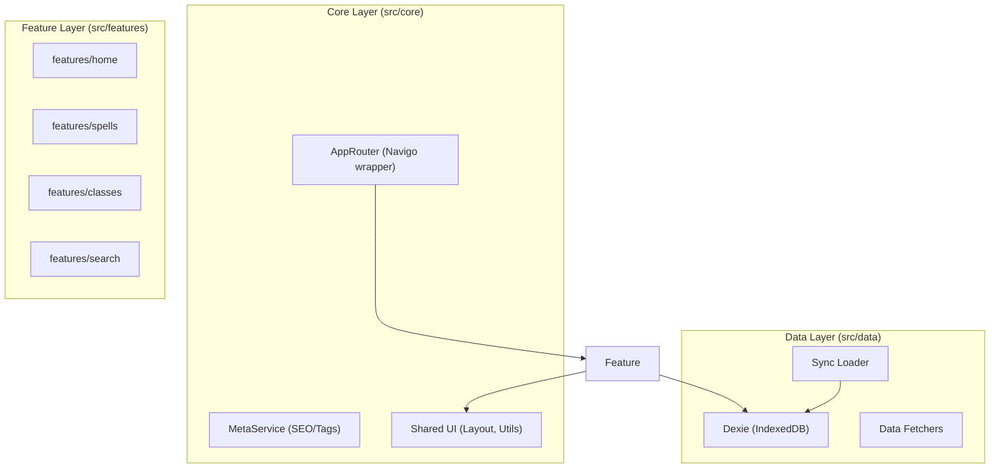

# Project Architecture: Tales of Valiant

This document describes the high-level architecture, data flow, and ground rules for the Tales of Valiant frontend.

## Module Map

The codebase is organized into three primary layers to ensure separation of concerns and scalability.

-   **`src/core/`**: Infrastructure that supports the entire app. Routing, SEO, and global UI layouts live here.
-   **`src/features/`**: Domain-specific logic. Each feature should encapsulate its own views, components, and (optionally) stores.
-   **`src/data/`**: The "Offline-First" engine. Handles IndexedDB storage, remote content synchronization, and low-level data access.

---

## Data Flow

1.  **Sync Phase**: On app load, `syncContent()` (in `loader.ts`) checks `site-manifest.json` for new hashes.
2.  **Storage**: Updated categories are fetched as JSON and stored in **IndexedDB** via **Dexie**.
3.  **Consumption**: Features (e.g., Spells) query the DB using the `Repo` utilities.
4.  **UI**: Lit components render the data, applying global styles from Tailwind CSS and DaisyUI.

---

## Ground Rules for New Functionality

### 1. Feature Isolation

Never add a new top-level view directly to `src/main.ts` or `src/views`.

-   **Rule**: Create a new folder in `src/features/[feature-name]`.
-   **Structure**: Include a `views/` folder for the main screens of that feature.

### 2. Routing & SEO

Every route must be registered in `appRouter` (within `main.ts`) with appropriate metadata.

-   **Rule**: Provide a `title` in the meta object for the `MetaService`.
-   **Dynamic SEO**: For detail pages, call `metaService.update({ title: item.name })` manually after the data is loaded.

### 3. State Management

-   **Rule**: Prefer **Lit properties** and **Events** for component communication.
-   **Rule**: Use **Dexie** as the single source of truth for persistent data. Do not use global state libraries like Redux or Zustand.

### 4. UI Consistency

-   **Rule**: Use **DaisyUI** classes (e.g., `btn`, `card`, `alert`) wherever possible.
-   **Rule**: Only use plain Tailwind classes for spacing, layout, and micro-adjustments not covered by DaisyUI.
-   **Rule**: Components must work **offline**. Test by disabling the network in DevTools.
