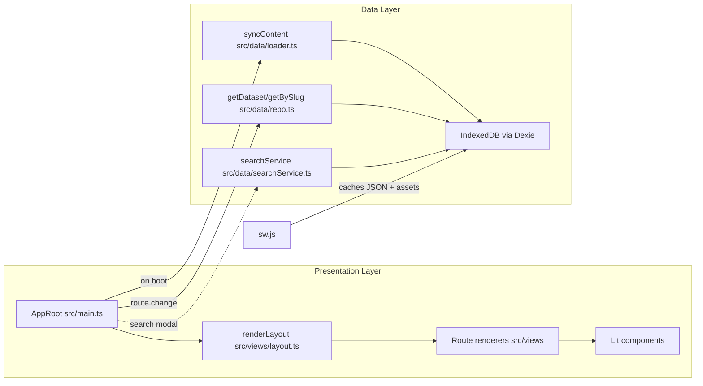
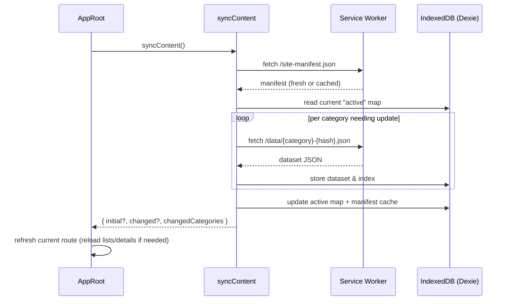

# Frontend Architecture Guide

This guide explains how the Tales of the Valiant frontend is put together, how data flows through it, and what to touch when you add new features. It is written for teammates who are new to UI work, so every section sticks to practical language and links back to the source files you will edit most often.

## Quick Start
- **Prerequisites**: Node.js 18.19+, `dist-site/` populated by the backend bundle generator (otherwise the mocked API cannot find datasets).
- **Install dependencies**: `npm install`
- **Run the dev server**: `npm run dev` (opens Vite on http://localhost:5173)
- **Build for production**: `npm run build`
- **Preview production build**: `npm run preview` (serves `dist/`)
- **Unit tests**: `npm run test:unit` (Vitest + jsdom + MSW)
- **End-to-end smoke tests**: `npm run test:e2e` (Playwright wrapper that skips if Node < 18.19)

> Tip: unit tests expect `dist-site/site-manifest.json` and JSON bundles to exist. After the backend runs, copy that folder next to the frontend root, or use `npm run mac-preview` which synchronises it for you.

## Project Layout
```
src/frontend/
├─ src/
│  ├─ components/      # Reusable Lit components (drawer, search modal, cards)
│  ├─ data/            # IndexedDB wrapper, manifest sync, search utilities
│  ├─ views/           # Pure rendering helpers for each route
│  ├─ main.ts          # AppRoot element + router + state orchestration
│  ├─ sw.ts            # Service worker entry (built to /sw.js)
│  └─ style.css        # Custom styles + design tokens
├─ tests/              # Vitest unit tests + Playwright e2e harness
├─ public/             # Static assets served as-is by Vite
├─ vite.config.ts      # Vite config and custom SW entry
└─ package.json        # Scripts and dependency definitions
```

## Runtime Architecture
The SPA is organised around a single custom element (`<app-root>`) that owns routing, state, and data loading. Rendering for each page lives in the `views/` folder so UI code stays declarative.



Key points:
- `Navigo` handles client-side routes and dispatches into `render*` helpers.
- State (filters, currently viewed entry, list caches) is stored as reactive properties on `AppRoot`, so Lit re-renders automatically when data changes.
- Content is persisted to IndexedDB, which keeps the app usable offline once a dataset has been fetched.

## Data Synchronisation
`syncContent` fetches the manifest generated by the backend, detects which categories changed, downloads only those JSON bundles, and stores them in IndexedDB. The service worker caches the same files to speed up repeat visits.



What to remember:
- JSON bundles are immutable (`<category>-<hash>.json`). If the hash changes, treat it as a new snapshot.
- The manifest also exposes `count` data for quick summary cards (`renderLayout` uses this for “Быстрый доступ”).
- When a new manifest arrives mid-session, `AppRoot` raises a toast so the user can reload and see fresh content.

## Routing & Views
- `AppRoot` wires up routes for `/spells`, `/classes`, `/talents`, etc. (`src/main.ts`)
- Each route delegates to a view helper: `renderSpells`, `renderTalents`, `renderCategoryList`, etc. These helpers return Lit `TemplateResult`s and stay side-effect free.
- `renderLayout` (`src/views/layout.ts`) wraps every view: it prints the navbar, sidebar, breadcrumbs, and the optional hero section for the home page. It also provides the mobile drawer behaviour.
- Scroll restoration: before navigating away from a list, call `rememberScroll`, and when the detail page renders it calls `scrollBack`.

## Search Experience
- `<search-modal>` (`src/components/SearchModal.ts`) is the UX entry point; it opens from the navbar or the `/` keyboard shortcut.
- `searchService` lazy-loads MiniSearch indexes from IndexedDB so the search runs entirely in the browser. Results are grouped by category.
- `AppRoot` uses a separate `searchAll` helper when rendering the dedicated `/search` route, which allows advanced fuzzy matching and URL-driven queries.

## Styling & Design System
- Styling is custom CSS defined in `src/style.css`. It defines design tokens (colours, spacing, shadows) and shared classes that keep the look consistent.
- When you compose new UI, reuse tokens and shared classes from `src/style.css` before introducing new bespoke styles.
- Global typography and layout tokens live in `src/style.css`; it sets CSS variables for both light and dark themes. Theme toggling is handled in `AppNavbar` by toggling `data-theme` and persisting it to `localStorage`.

## Service Worker & Offline Behaviour
- `src/sw.ts` is bundled by Vite into `/sw.js` and registered only in production builds (`AppRoot.connectedCallback`).
- Strategies:
  - Navigation requests → network-first (`/index.html` kept fresh but cached for offline fallback).
  - `assets/` bundles → cache-first (hashed filenames).
  - `/site-manifest.json` → network-first.
  - `/data/*.json` and `/index/*.json` → cache-first (matches immutable semantics).
- Once a user visits a page, the dataset and its search index are stored in both IndexedDB and the SW cache, so subsequent loads are instant and offline friendly.

## Testing Strategy
- **Unit tests** (`tests/unit`) run in jsdom with fake IndexedDB and MSW interceptors (`tests/setup.vitest.ts`). They mount Lit components and stub out network calls.
- **Fixtures** in `tests/fixtures` mirror sample manifest/data responses. Some tests switch manifests on the fly via `useAltManifest()`.
- **E2E tests** (`tests/e2e`) rely on Playwright. The helper script checks the Node version before spawning `npx playwright test` so local runs do not fail silently on older runtimes.

Common gotchas:
- If unit tests complain about missing files, ensure `dist-site` exists and contains data/index bundles.
- Tests run with `globalThis.litDisableDevMode = true` so Lit does not throw on dynamic property assignment.

## Extending the App
1. **Add a new dataset category**
   - Make sure the backend emits a bundle (`<category>-<hash>.json`) and registers it in the manifest.
   - Extend the router in `src/main.ts` and add list/detail view helpers in `src/views/`.
   - Reuse `getDataset` / `getBySlug` so you do not duplicate storage access logic.

2. **Create a new view**
   - Add a pure function that returns a `TemplateResult`.
   - Use existing UI primitives (`sourceBadges`, `shell`, `loadingSpinner`).
   - Wire it into the layout via breadcrumbs and sidebar links if it is a top-level route.

3. **Customise search**
   - Update the MiniSearch configuration in `src/data/search.ts` or `src/data/searchService.ts`.
   - Stored documents already include category/name/tags—extend those structures in the backend if you need new filters.

4. **Adjust styling**
   - Prefer updating shared tokens and utilities in `src/style.css`.
   - For component-specific tweaks, keep styles close to the Lit component for clarity.

## Troubleshooting
- **No data on first load**: `syncContent` only works if the manifest is reachable. Check the browser console for network errors and confirm the service worker is not serving a stale cached version.
- **Search returns empty results**: verify the manifest includes `indexHash` for the target category and that the IndexedDB `indexes` table contains entries.
- **Service worker stuck on old build**: clear application storage in the browser devtools or bump the cache constants in `src/sw.ts`.

Feel free to expand this document as the app grows—especially with screenshots or tips specific to your workflow.
